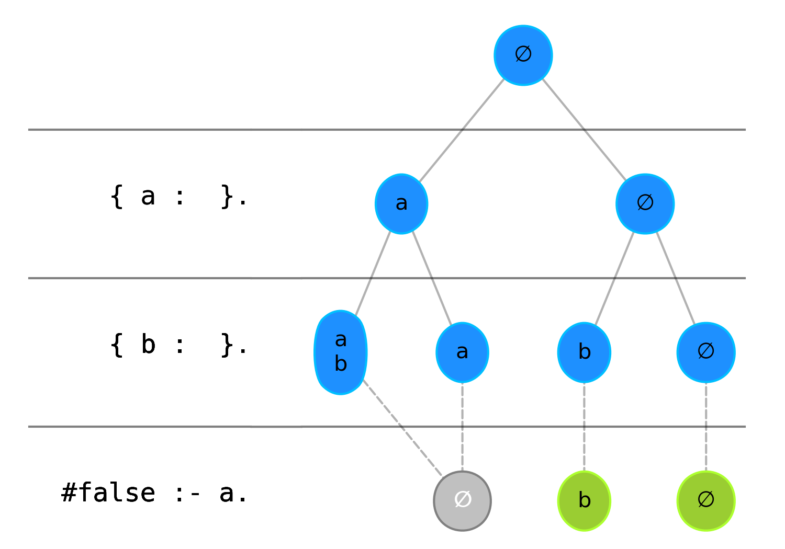

# vizlo
Vizlo is a visualization extension for [clingo](https://potassco.org/clingo/). 
It is intended to help you visualize and potentially debug programs by showing an 
iterative simulation of the solving process.


## Installation

Vizlo will be distributed over conda-forge soon. Until then, install like this:

* Make sure you have clingo installed via conda: `conda install -c potassco clingo`
* Install via pip directly from github: `python -m pip install git+https://github.com/glaserL/vizlo.git`

## Usage
Debuggo wraps itself around the Control object of the clingo python API. We assume you are familiar with the 
[clingo python API](https://potassco.org/clingo/python-api/5.4/).


```python
import vizlo
import matplotlib.pyplot as plt

ctl = vizlo.VizloControl(["0"])
ctl.add("base", [], "{a}. {b}. :- a.")
ctl.ground([("base", [])])
ctl.paint()
plt.show()
```

# Example
The resulting output is a visualization like the one below. Vizlo sorts the statements of a given logic
program by their dependencies. That way we can simulate an iterative solving flow. Recursions and sets of rules that an 
atom depends on are merged together into one solving step (one line in the graphic.) 

```
{a}.
{b}.
:- a.
```
---


# API
Vizlo extends the `clingo.Control` object with two functions, `paint` and `add_to_painter`:

`paint(self, atom_draw_maximum=20, show_entire_model=False, sort_program=True, figsize=None, dpi=300, rule_font_size=12, model_font_size=10):`


